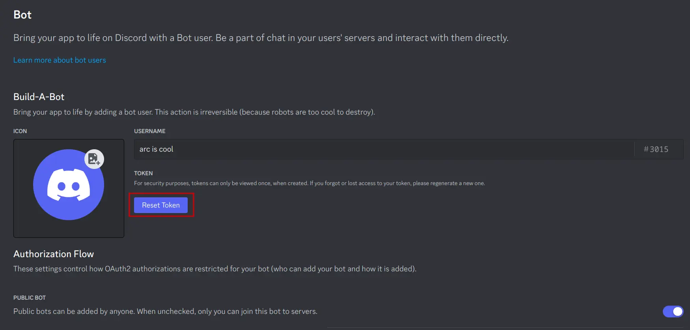

# Getting Started

This document assumes basic familiarity with **Python**, **async/await** and **type-hints**. If you need a refresher on any of these topics, here's a few helpful resources:

??? abstract "Resources for learning more"

    **Basic Python**

    - [Official Tutorial](https://docs.python.org/3/tutorial/)
    - [Automate the Boring Stuff](https://automatetheboringstuff.com/)
    - [Python Cheatsheet](https://learnxinyminutes.com/docs/python3/)
    - [Real Python Tutorials](https://realpython.com/)

    **`async/await` and `asyncio`**

    - [Real Python asyncio walkthrough](https://realpython.com/async-io-python/#setting-up-your-environment)
    - [FastAPI async/await guide](https://fastapi.tiangolo.com/async/#asynchronous-code)
    - [Python `asyncio` module reference](https://docs.python.org/3/library/asyncio.html)

    **Typing and type-hints**

    - [FastAPI Python Types Intro](https://fastapi.tiangolo.com/python-types/)
    - [Type hints cheat sheet](https://mypy.readthedocs.io/en/latest/cheat_sheet_py3.html)

No prior experience with making Discord bots is required.

## Installation

To install `arc`, run the following command in your terminal:

```sh
pip install hikari-arc
```

To make sure `arc` installed correctly, run the following command:

=== "Windows"

    ```sh
    py -m arc
    ```
=== "macOS, Linux"

    ```sh
    python3 -m arc
    ```

If successful, it should output basic information about the library.

!!! note
    Please note that `arc` requires a Python version of **at least 3.10**.

## Setting up a Discord Bot

!!! tip
    If you already have a Discord bot set up and a **token** ready to go, skip to the [next section](#basic-usage).

The first step to creating a Discord bot is to create a **bot user** on the developer portal. [Navigate to the developer portal](https://discord.com/developers/applications) and create a new
bot:


<div class="grid cards" markdown>

-   :material-plus-circle:{ .lg .middle } **Create a new application**

    ---

    <figure markdown>
        <figure markdown>
            { width=800 }
            <figcaption></figcaption>
        </figure>
    <figcaption>By creating an app you accept [Discord's Developer Terms of Service](https://discord.com/developers/docs/policies-and-agreements/developer-terms-of-service).</figcaption>
    </figure>

-   :material-robot:{ .lg .middle } **Navigate to the bot tab**

    ---

    <figure markdown>
    { width="150" }
    <figcaption></figcaption>
    </figure>

-   :material-form-textbox-password:{ .lg .middle } **Create a new token**

    ---

    <figure markdown>
        <figure markdown>
            { width=800 }
            <figcaption></figcaption>
        </figure>
    <figcaption>Keep this token for later, you'll need it to start your bot.</figcaption>
    </figure>

-   :fontawesome-solid-paper-plane:{ .lg .middle } **Invite the bot**

    ---

    <figure markdown>
        <figure markdown>
            { width=200 }
            <figcaption></figcaption>
        </figure>
    <figcaption>Tick any permissions your bot will need as well.</figcaption>
    </figure>

</div>


!!! danger
    Anyone with access to this token has **full access to your bot's account**, you should ensure that nobody has access to this token but you. Treat it like a username/password combination, but for bots.

??? info "Additional steps for REST Bots"
    For most people, these steps are **not required**, however if you're setting up a `RESTBot`, you need to perform these additional steps to get going.

    If you're unsure if you need this, see the difference between [REST & Gateway bots](#difference-between-gatewaybot-restbot).

    <div class="grid cards" markdown>

    -   :material-link:{ .lg .middle } **Get a URL for your interactions**

        ---

        You'll need a URL with port `8080` accessible and visible to the open internet with TLS (`https://`). Hold on to this URL for the next step.

        !!! tip
            There are multiple services available that let you generate temporary URLs that meet
            these criteria for local development, such as [:simple-visualstudiocode: **Visual Studio Code**](https://code.visualstudio.com/)'s built-in
            [port-forwarder](https://code.visualstudio.com/docs/editor/port-forwarding), or [localhost.run](https://localhost.run/).
            If you're using such services, ensure the URL is publicly accessible.

            Some of these services may also randomly assign a new URL to you when you repeat this process, in that case you should
            update the interaction URL on Discord's developer portal as well, to keep them in sync.

    -   :material-link-plus:{ .lg .middle } **Add the interaction endpoint URL**

        ---

        <figure markdown>
        
        <figcaption></figcaption>
        </figure>

        !!! note
            You will need to have a RESTBot running and responding to interactions at this URL for Discord to accept the URL as valid.
            You can briefly run the basic REST example for this purpose, [shown below](#basic-usage-rest).
    </div>


## Basic Usage

=== "Gateway"

    ```py
    import hikari
    import arc

    # Create an instance of a GatewayBot
    # Paste your bot token from the dev portal in here
    bot = hikari.GatewayBot("TOKEN")

    # Pass it to arc
    client = arc.GatewayClient(bot)


    @client.include # Add it to the client
    @arc.slash_command("hi", "Say hi to someone!") # Define a new command
    async def hi_slash(
        ctx: arc.GatewayContext,
        # Add a new slash option that asks for a user
        user: arc.Option[hikari.User, arc.UserParams("The user to say hi to.")]
    ) -> None:
        await ctx.respond(f"Hey {user.mention}!")

    # This should be the last line, no code will be run after this
    bot.run()
    ```


=== "REST"

    ```py
    import hikari
    import arc

    # Create an instance of a RESTBot
    # Paste your token from the dev portal in here
    bot = hikari.RESTBot("TOKEN")

    # Pass it to arc
    client = arc.RESTClient(bot)


    @client.include # Add it to the client
    @arc.slash_command("hi", "Say hi to someone!") # Define a new command
    async def hi_slash(
        ctx: arc.RESTContext,
        # Add a new slash option that asks for a user
        user: arc.Option[hikari.User, arc.UserParams("The user to say hi to.")]
    ) -> None:
        await ctx.respond(f"Hey {user.mention}!")

    # This should be the last line, no code will be run after this
    bot.run()
    ```

!!! warning
    For the purposes of this example, the token is inserted directly into the source file. You should try to **avoid doing this**, and instead store the token in a [.env](https://pypi.org/project/python-dotenv/) file or similar.

Paste the code above into a file and run it. The bot should start, register the command we defined, which should now be invokable via `/hi` in any server the bot is present in.

??? bug "Troubleshooting common setup mistakes"

    **I'm getting `401 Unauthorized` when starting the bot!**

    Ensure that your token is valid, and that you have copied the **bot token**, and not the application secret or some other credentials. If unsure, refer to the third step of [setting up a bot](#setting-up-a-discord-bot) and create a new token again.

    **The bot starts but doesn't respond to the slash command!**

    If you're using a **RESTBot**, ensure the interaction URL is set up properly and is valid on the developer portal. If you're using a **GatewayBot**, ensure there is **no interaction URL set** at all.

    **The bot is failing to create commands!**

    Ensure that the invite link you invited the bot with has the `bot` and `application.commands` scopes ticked. If unsure, refer to the fourth step of [setting up a bot](#setting-up-a-discord-bot) and reinvite the bot.

## Difference between GatewayBot & RESTBot

!!! tip
    If you're unsure which one to choose, we recommend getting started with a **Gateway bot**.

There are two main ways for a bot to connect to Discord & receive [interactions](./guides/interactions.md), via either a **GatewayBot** or a **RESTBot**.

A bot connected to the [**Gateway**](https://discord.com/developers/docs/topics/gateway "Discord's fancy way of saying WebSocket") needs to maintain a constant connection to Discord's servers through a [WebSocket](https://en.wikipedia.org/wiki/WebSocket "A way of establishing realtime two-way communication between client & server"),
and in turn receives [**events**](./guides/events.md) that inform it about things happening on Discord in real time (messages being sent, channels being created etc...).
[**Interactions**](./guides/interactions.md) are also delivered to a bot of this type through the Gateway as events. In addition, Gateway bots typically have a [*cache*][arc.client.GatewayClientBase.cache] and can manage complex state.
This model is ideal for bots that need to do things other than just responding to slash commands, such as reading and responding to messages sent by users, or acting on other server events (e.g. a moderation bot).

A **RESTBot** however, isn't constantly connected to Discord, instead, you're expected to host a small HTTP server, and Discord will send [interactions](./guides/interactions.md) to your server
by making HTTP `POST` requests to it. RESTBots **only receive [interactions](./guides/interactions.md)** from Discord, they **do not receive events** or other types of data. They are ideal for bots that manage little to no state,
and rely only on users invoking the bot via slash commands. Setting up a RESTBot however is slightly more complicated compared to a GatewayBot, as it requires a [domain](https://en.wikipedia.org/wiki/Domain_name "A domain name, like 'www.example.com'") with [TLS](https://en.wikipedia.org/wiki/Transport_Layer_Security "Transport Layer Security") for Discord to be able to send interactions to your webserver.

!!! question "Does this mean a Gateway bot cannot use the REST API?"
    **No.** Both Gateway & REST bots have access to the HTTP REST API Discord provides (see [`Client.rest`][arc.abc.client.Client.rest]), the primary difference between the two bot types is how Discord communicates with **your bot**, and what information it sends to it.

## Recommended tooling

`arc` works best when you use a **static type-checker**. It can ensure your code is correct and detect type errors without you even running your code! It's not required to use one, but is highly recommended, as `arc` was made with type-safety in mind.

### Install pyright (optional)

The recommended type-checker for `arc` is [pyright](https://github.com/microsoft/pyright).

=== ":simple-visualstudiocode: Visual Studio Code"
    **VS Code** ships **pyright** with the [Python](https://marketplace.visualstudio.com/items?itemName=ms-python.python) extension, however it is **disabled by default**. To enable it, navigate to `File > Preferences > Settings` and search for `python.analysis.typeCheckingMode`. Set this to either "basic" or "strict". For more information on using Python with VS Code, see the [official documentation](https://code.visualstudio.com/docs/languages/python).

=== ":octicons-code-square-16: Other editors & CLI"
    See the [installation instructions](https://github.com/microsoft/pyright/blob/main/docs/installation.md) on how to set up pyright.

    !!! failure ""
        It is worth noting that **PyCharm's free version doesn't support pyright** due to [lacking LSP support](https://blog.jetbrains.com/platform/2023/07/lsp-for-plugin-developers/#supported-ides). You may use pyright from the command line as an alternative, or switch to another editor that [supports LSP](https://microsoft.github.io/language-server-protocol/implementors/tools/) properly.

## So I have a bot, now what?

You made it! Congratulations on creating your first Discord bot with `arc`! Check out the [guides page](./guides/index.md) and decide where to go next. If you feel lost, or have questions to ask, you may join the [hikari Discord server](https://discord.gg/hikari) and ask for help in the `#arc` channel.
