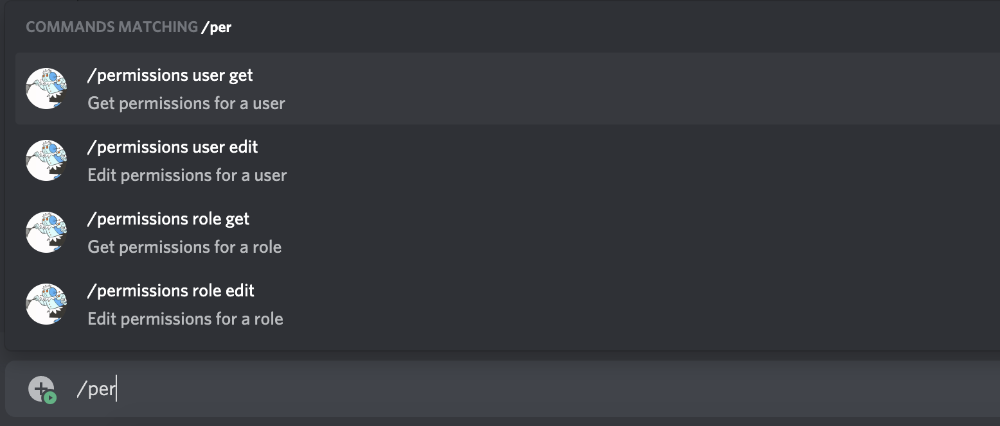

# Command Groups

**Slash commands** can be organized into **command groups**, creating a hierarchy. Nesting is supported, but only one level deep, meaning that a top-level group may contain groups, but the subgroups **must** contain subcommands.

??? info "Examples of supported nesting configurations"

    ```
    VALID

    group
    │
    ├─ subcommand
    │
    └─ subcommand

    ----

    VALID

    group
    │
    ├─ subgroup
    │   │
    │   └─ subcommand
    │
    └─ subgroup
        │
        └─ subcommand

    ----

    VALID

    group
    │
    ├─ subgroup
    │   │
    │   └─ subcommand
    │
    └─ subcommand

    -------

    INVALID
    Subgroups cannot contain subgroups

    group
    │
    ├─ subgroup
    │   │
    │   └─ subgroup
    │
    └─ subgroup
        │
        └─ subgroup

    ----

    INVALID
    Subcommands cannot contain subgroups

    group
    │
    ├─ subcommand
    │   │
    │   └─ subgroup
    │
    └─ subcommand
        │
        └─ subgroup
    ```

!!! failure ""
    Using subcommands or subcommand groups will make your top-level group **unusable**. You can't send the base `/permissions` as a valid command if you also have `/permissions add | remove` as subcommands or subcommand groups.

For example, if you're developing a moderation bot, you may want to create a `/permissions` command that can:

- Get the guild permissions for a user or a role
- Get the permissions for a user or a role on a specific channel
- Change the guild permissions for a user or a role
- Change the permissions for a user or a role on a specific channel

We'll start by defining the top-level [`SlashGroup`][arc.command.slash.SlashGroup]. This is a special type of "command" that has no
callback, and acts as a sort of "folder" to add other commands to. A slash group can be added via [`Client.include_slash_group()`][arc.abc.client.Client.include_slash_group] (or [`Plugin.include_slash_group()`][arc.abc.plugin.PluginBase.include_slash_group], if working with a plugin).

```py
permissions = client.include_slash_group("permissions", "Get or edit permissions for a user or role")
```

Next, we can define subgroups that this group will contain via [`SlashGroup.include_subgroup`][arc.command.slash.SlashGroup.include_subgroup]:

```py
user = group.include_subgroup("user", "Get or edit permissions for a user")

role = group.include_subgroup("role", "Get or edit permissions for a role")
```

Finally, we can simply `@include` the commands in the group:

=== "Gateway"

    ```py
    @user.include
    @arc.slash_subcommand("get", "Get permissions for a user")
    async def perms_user_get(ctx: arc.GatewayContext) -> None:
        ...

    @user.include
    @arc.slash_subcommand("edit", "Edit permissions for a user")
    async def perms_user_edit(ctx: arc.GatewayContext) -> None:
        ...

    @role.include
    @arc.slash_subcommand("get", "Get permissions for a role")
    async def perms_role_get(ctx: arc.GatewayContext) -> None:
        ...

    @role.include
    @arc.slash_subcommand("edit", "Edit permissions for a role")
    async def perms_role_edit(ctx: arc.GatewayContext) -> None:
        ...
    ```

=== "REST"

    ```py
    @user.include
    @arc.slash_subcommand("get", "Get permissions for a user")
    async def perms_user_get(ctx: arc.RESTContext) -> None:
        ...

    @user.include
    @arc.slash_subcommand("edit", "Edit permissions for a user")
    async def perms_user_edit(ctx: arc.RESTContext) -> None:
        ...

    @role.include
    @arc.slash_subcommand("get", "Get permissions for a role")
    async def perms_role_get(ctx: arc.RESTContext) -> None:
        ...

    @role.include
    @arc.slash_subcommand("edit", "Edit permissions for a role")
    async def perms_role_edit(ctx: arc.RESTContext) -> None:
        ...
    ```

Subcommands can be included in either top-level groups or subgroups.

!!! warning
    Slash subcommands **must** use the [`@arc.slash_subcommand`][arc.command.slash.slash_subcommand] decorator
    instead of the [`@arc.slash_command`][arc.command.slash.slash_command] decorator.

With the following setup, you should get something similar to this:

<figure markdown>
  { width="800" }
  <figcaption></figcaption>
</figure>

You can then proceed adding [options](./options.md) to the subcommands and develop your command logic.

## Other Limitations

Only top-level commands & groups can have the following defined:

- `default_permissions`
- `is_nsfw`
- `is_dm_enabled`
- `guilds`

Subcommands & subgroups inherit these settings from the parent group. This is due to how Discord represents subcommands & subgroups in the API.
