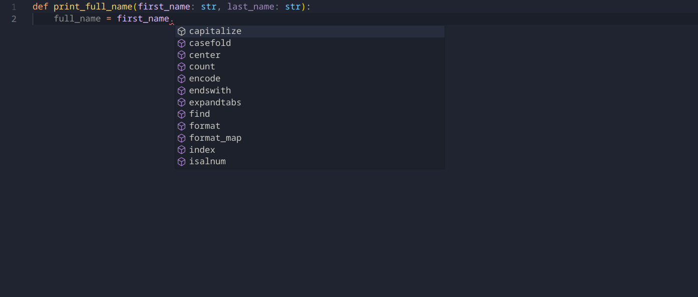
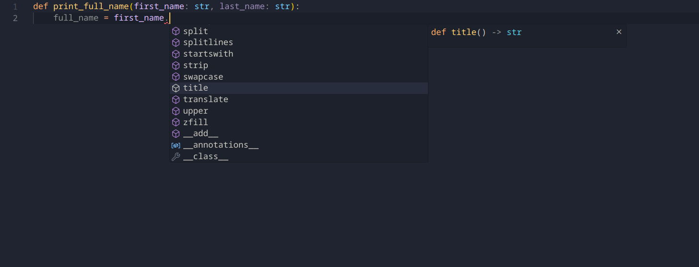
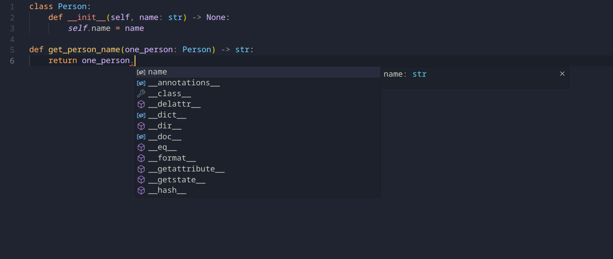

# Types & Type Hinting

!!! abstract "Disclaimer"
    This guide is an adaptation of FastAPI's [excellent python types guide](https://fastapi.tiangolo.com/python-types/) with specific focus on how it fits into `arc`. FastAPI is licensed under the [MIT License](https://github.com/tiangolo/fastapi/blob/master/LICENSE).

Python has support for optional "type hints" (also called "type annotations"). These **"type hints"** or annotations are a special syntax that allow declaring the [type](# "For example: str, int, float, bool") of a variable. By declaring types for your variables, editors and tools can give you better support.

This is just a **quick tutorial / refresher** about Python type hints. It covers only the minimum necessary to use them with `arc`, which is actually very little.

!!! tip
    If you are a Python expert, and you already know everything about type hints, feel free to skip this guide.

## Motivation

Let's start with a simple example:

```py
def print_full_name(first_name, last_name):
    full_name = first_name.title() + " " + last_name.title()
    print(full_name)


print_full_name("john", "doe")
```

Running this program outputs:

```console
John Doe
```

The function does the following:

- Takes a `first_name` and `last_name`.
- Converts the first letter of each one to upper case with `title()`.
- [Concatenates](# "Puts them together, as one. With the contents of one after the other.") them with a space in the middle.

```py hl_lines="2"
def print_full_name(first_name, last_name):
    full_name = first_name.title() + " " + last_name.title()
    print(full_name)


print_full_name("john", "doe")
```

### Edit it

It's a very simple program. But now imagine that you were writing it from scratch. At some point you would have started the definition of the function, you had the parameters ready...

But then you have to call "*that method that converts the first letter to upper case*". Was it `upper`? Was it `uppercase`? `first_uppercase`? `capitalize`?

Then, you try with the old programmer's friend, editor autocompletion. You type the first parameter of the function, `first_name`, then a dot (`.`) and then hit `Ctrl+Space` to trigger the completion.

But, sadly, you get nothing useful:


### Add types

Let's modify a single line from the previous version.

We will change exactly this fragment, the parameters of the function, from:

```py
    first_name, last_name
```

to:

```py
    first_name: str, last_name: str
```

That's it.

Those are the "type hints":

```py hl_lines="1"
def print_full_name(first_name: str, last_name: str):
    full_name = first_name.title() + " " + last_name.title()
    print(full_name)


print_full_name("john", "doe")
```

That is **not** the same as declaring default values like would be with:

```py
    first_name="john", last_name="doe"
```

It's a different thing. We are using colons (`:`), not equals (`=`).

!!! note
    Adding type hints normally **doesn't change** what happens from what would happen without them.
    They are just "hints" as to what the types may be, hence the name.

But now, imagine you are again in the middle of creating that function, but with type hints. At the same point, you try to trigger the autocomplete with `Ctrl+Space` and you see:



With that, you can scroll, seeing the options, until you find the one that "rings a bell":



## More motivation

Check this function, it already has type hints:

```py hl_lines="1"
def print_name_with_age(name: str, age: int):
    name_with_age = name + " is this old: " + age
    print(name_with_age)
```

Because the editor knows the types of the variables, you don't only get completion, you [may also get error checks](../getting_started.md#recommended-tooling):


Now you know that you have to fix it, convert `age` to a string with `str(age)`:

```py hl_lines="2"
def print_name_with_age(name: str, age: int):
    name_with_age = name + " is this old: " + str(age)
    print(name_with_age)
```


## Declaring types

You just saw the main place to declare type hints. As function parameters. This is also the main place you would use them with `arc`.

### Simple types

You can declare all the standard Python types, not only `str`.

You can use, for example:

- [`int`][int]
- [`float`][float]
- [`bool`][bool]
- [`bytes`][bytes]

```py hl_lines="1"
def get_items(item_a: str, item_b: int, item_c: float, item_d: bool, item_e: bytes):
    return item_a, item_b, item_c, item_d, item_d, item_e
```

### The return type

Functions may return values, and it's important to also annotate this information, so [callers](# "Users using your function (including you!)") know what type they are getting.

This can be done by adding the `-> Something:` notation at the end of a function signature:

```py hl_lines="1"
def add(a: int, b: int) -> int:
    return a + b
```

### Generic types with type parameters

There are some data structures that can contain other values, like [`dict`][dict], [`list`][list], [`set`][set] and [`tuple`][tuple]. And the internal values can have their own type too.

These types that have internal types are called "**generic**" types. And it's possible to declare them, even with their internal types.


#### List

For example, let's define a variable to be a [`list`][list] of `str`. Declare the variable, with the same colon (`:`) syntax, as the type, put `list`.

As the list is a type that contains some internal types, you put them in square brackets:

```py hl_lines="1"
def process_items(items: list[str]) -> None:
    for item in items:
        print(item)
```

!!! info
    Those internal types in the square brackets are called "type parameters".

    In this case, `str` is the type parameter passed to `List` (or `list` in Python 3.9 and above).

That means: "the variable `items` is a `list`, and each of the items in this list is a `str`".

By doing that, your editor can provide support even while processing items from the list:


Without types, that's almost impossible to achieve. Notice that the variable `item` is one of the elements in the list `items`, and still, the editor knows it is a `str`, and provides support for that.

#### Tuple and Set

You would do the same to declare [`tuple`][tuple]s and [`set`][set]s:


```py hl_lines="1"
def process_items(items_t: tuple[int, int, str], items_s: set[bytes]) -> None:
    return items_t, items_s
```

This means:

- The variable `items_t` is a `tuple` with 3 items, an `int`, another `int`, and a `str`.
- The variable `items_s` is a `set`, and each of its items is of type `bytes`.

#### Dict

To define a [`dict`][dict], you pass 2 type parameters, separated by commas.

- The first type parameter is for the **keys** of the `dict`.
- The second type parameter is for the **values** of the `dict`:

```py hl_lines="1"
def process_items(prices: dict[str, float]) -> None:
    for item_name, item_price in prices.items():
        print(item_name)
        print(item_price)
```

This means:

- The variable `prices` is a `dict`:
    - The **keys** of this `dict` are of type `str` (let's say, the name of each item).
    - The **values** of this `dict` are of type `float` (let's say, the price of each item).

#### Union

You can declare that a variable can be any of **several types**, for example, an `int` or a `str`.

To declare a union, put the possible types in the type hint seperated by a vertical bar (`|`).


```py hl_lines="1"
def process_item(item: int | str) -> None:
    print(item)
```

In both cases this means that `item` could be an `int` or a `str`.

#### Possibly `None`

You can declare that a value could have a type, like `str`, but that it could also be `None`.

This can simply be done with `Something | None`:


```py hl_lines="1"
def say_hi(name: str | None = None) -> None:
    if name is not None:
        print(f"Hey {name}!")
    else:
        print("Hello World")
```

### Classes as types

You can also declare a class as the type of a variable.

Let's say you have a class `Person`, with a name:

```py hl_lines="1-3"
class Person:
    def __init__(self, name: str) -> None:
        self.name = name


def get_person_name(one_person: Person) -> str:
    return one_person.name
```

Then you can declare a variable to be of type `Person`:

```Python hl_lines="6"
class Person:
    def __init__(self, name: str):
        self.name = name


def get_person_name(one_person: Person) -> str:
    return one_person.name
```

And then, again, you get all the editor support:



Notice that this means "`one_person` is an **instance** of the class `Person`". It doesn't mean "`one_person` is the **class** called `Person`".

## Type aliases

Complex types can quickly get very verbose to type hint. For example, let's imagine you have a `list` of `dict`s that each contain a `set` of `int`s.

The type for that would be `list[dict[str, set[int]]]`. Let's say you want to define a function that performs operations on this data:

```py
def do_stuff(data: list[dict[str, set[int]]]) -> list[dict[str, set[int]]]:
    ...
```

If you have lots of such functions, it can quickly get cumbersome to type `list[dict[str, set[int]]]` over and over again.

Instead, you can alias `list[dict[str, set[int]]]` to a nicer name you can actually remember:

=== "Python 3.12+"

    Python 3.12 and above have dedicated syntax for declaring type aliases via the `type` keyword:

    ```py hl_lines="1"
    type DataT = list[dict[str, set[int]]]

    def do_stuff(data: DataT) -> DataT:
        ...
    ```


=== "Python 3.10 & 3.11"

    Simply assign the type to a new variable to create an alias:

    ```py hl_lines="1"
    DataT = list[dict[str, set[int]]]

    def do_stuff(data: DataT) -> DataT:
        ...
    ```

You can now use `DataT` anywhere where you would type `list[dict[str, set[int]]]` instead.

Note that this doesn't actually change any of the types, you just gave a new [name](# "an alias, to be precise") to an already existing type.

## Type Hints with Metadata Annotations

Python also has a feature that allows putting **additional metadata** in these type hints using [`Annotated`][typing.Annotated].

`Annotated` is part of the standard library, so you can just import it from `typing`:

```py hl_lines="1  3"
from typing import Annotated

def say_hello(name: Annotated[str, "this is just metadata"]) -> str:
    return f"Hello {name}"
```

Python itself doesn't do anything with this `Annotated`. And for editors and other tools (such as type-checkers), the type is still `str`.

But you can use this space in `Annotated` to provide `arc` with additional metadata, specifically when [defining a command's options](./options.md).

The important thing to remember is that **the first *type parameter*** you pass to `Annotated` is the **actual type**. The rest, is just metadata for other tools.

!!! tip
    [`arc.Option`][arc.abc.option.Option] is actually just a [**type alias**](#type-aliases) for `typing.Annotated`, you can use both interchangeably when defining your commands!

## Common `hikari` primitive types

You may encounter some types when using [`hikari`](https://github.com/hikari-py/hikari) that aren't present in the standard library:

- [`hikari.Snowflake`](https://docs.hikari-py.dev/en/latest/reference/hikari/snowflakes/#hikari.snowflakes.Snowflake) - This is an ID of an object on Discord, for most purposes you can treat this type as an `int`.
- [`hikari.Snowflakeish`](https://docs.hikari-py.dev/en/latest/reference/hikari/snowflakes/#hikari.snowflakes.Snowflakeish) - This is just an alias for `int | hikari.Snowflake`.
- [`hikari.UndefinedType`](https://docs.hikari-py.dev/en/latest/reference/hikari/snowflakes/#hikari.snowflakes.Snowflakeish) and it's value [`hikari.UNDEFINED`](https://docs.hikari-py.dev/en/latest/reference/hikari/undefined/#hikari.undefined.UNDEFINED) - These are used when not providing a value would be semantically different from providing `None`. For example, when [editing a message](https://docs.hikari-py.dev/en/latest/reference/hikari/api/rest/#hikari.api.rest.RESTClient.edit_message), leaving `embeds=` as `UNDEFINED` will leave them as is, but providing `None` will clear all embeds from a message.

## Finishing up

That's the basics of Python typing in a nutshell! If you already went through all the tutorial and came back to see more about types, a good resource is [the "cheat sheet" from `mypy`](https://mypy.readthedocs.io/en/latest/cheat_sheet_py3.html).
